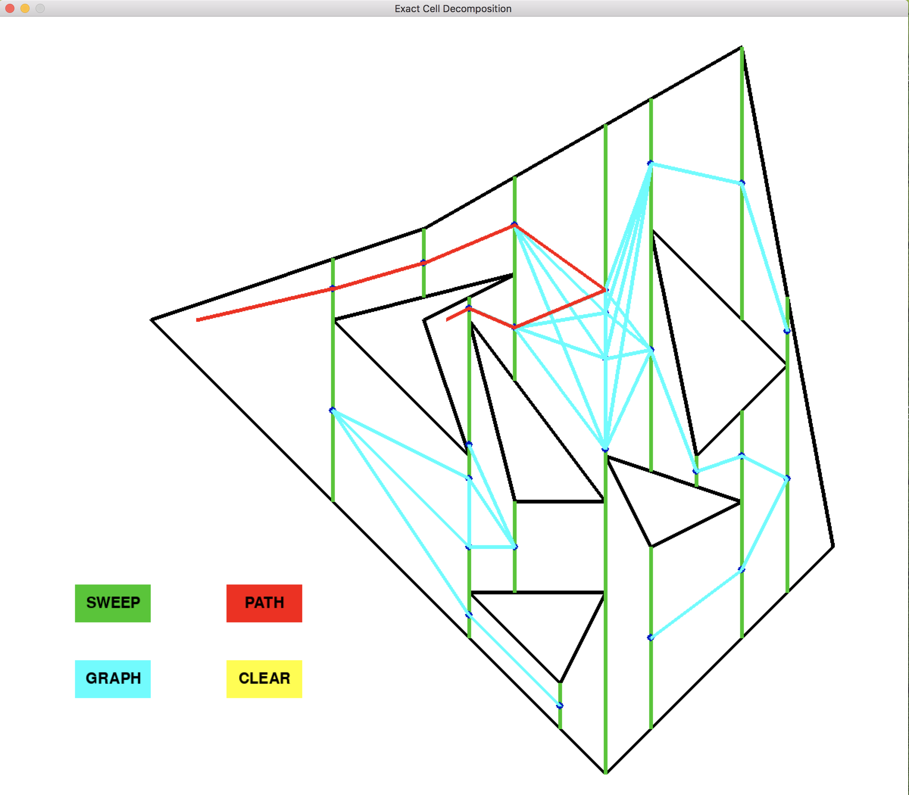
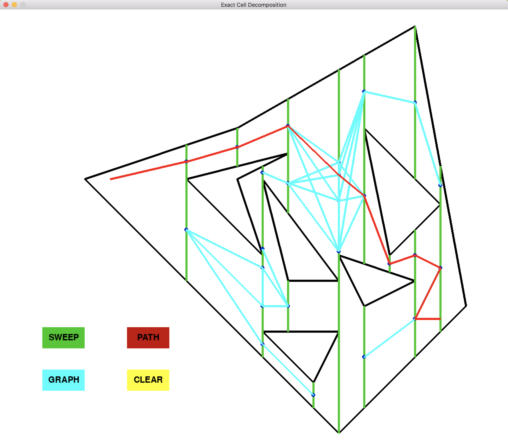

## A Robot Motion Planning Project 
## By: Ved Paranjape

#### I implemented my own exact cell decomposition algorithm using plain python without incorporating any 3rd party motion planning libraries. It was implemented using concepts from Computational Geometry for collision checking. For simulation of the environment and for graphics, the python pygame library was used. The following is a summary of the project details and some specifics of the implementation aspects.

## Introduction
#### Exact Cell Decomposition divides the workspace into multiple connected units (cells) which are trapezoidal in shape as shown in the following figure. 

## Cool or Meh?
#### I tried making the algorithm as robust as possible and I did to a good extent. I will leave it to the readers after reading this blog if they think that the project is cool. 
#### Lets take a look at a comparitively easy start and goal configurations. 

#### The green lines are the trapezium edges, the blue lines make up the connectivity graph and the red lines connect the start and goal configurations through the connectivity graph which is taken care by the Dijkstra's algorithm. So, the left end of the red lines is the start and right end is the goal (these can be adjusted which is explained later). Clicking the colored button renders the respective colored graphics, cool right?
#### Fairly easy right?. Lets step it up a notch. Lets see if the algorithm can find a path if we add a point in the concave region of the obstacle.

#### It does! But is it robust enough if we add more obstacles?

#### The algorithm passed all the obstacles and transferred the robot in a collision free manner through the environment. Cool or meh?

## Execution
#### These trapezoids are constructed by sweeping a vertical line from the minimum x to the maximum x coordinate of the workspace. Whenever the sweep line reaches a vertex (outer boundary vertex or an obstacle vertex), the points of intersection of the line with the all the edges of the environment are found out. This is done with the help of computational geometry algorithm for finding out the point of intersection of a line. The format of the line for this purpose has been tweaked into a homogeneous slope intercept format as follows:

### [slope, -1, y-intercept]

#### The code is hosted on my github (Please click the "View on Github" button).
#### This list is used to compute the point of intersection. The two endpoints of the two lines for which the point of intersection is to be found are passed as arguments to the function point_of_intersection(). To convert the line to the homogeneous format, the two endpoints of the line such as [a,b] and [c,d] for a line ab-cd are passed to the do-edge-equation() function. While entering the coordinates, please keep in mind to enter the coordinates of the obstacles inside the boundary. To change the start and goal of the robot, edit the coordinates of the robot on lines 583 and 584 of the code respectively. The trapezoidal lines (green lines in the above picture) are constructed by sending an edge from the vertices whose x-coordinates are equal to the x of the sweep line at the current location (I call these vertices as the event vertices). A line is constructed  vertically above and below each of the event vertices until these lines intersect the obstacle boundaries or the outer boundary. 
#### The next step after constructing the trapezoids is finding the midpoints of these lines. This is done because the midpoints can guarantee the successful traversal of the robot without collision. These midpoints form the connnectivity graph vertices. The connectivity graph is shown by the blue color in the graphics. Once the midpoints are found, the sweep line is again swept to find out which cells are adjacent to each other and then, the final connectivity graph is constructed. This is done between lines 497 and 558 of the code. Once the connectivity graph is constructed, the points closest to the start and goal points is found from the connectivity graph. Another checking is necessary, ie. if the line connecting the start and the point from the connectivity graph closest to the start; same for goal point. 

## Structure
#### The code consists of 3 classes: Environment, Obstacle and constructGraph. The Environment creates the outer boundary of the workspace and the Obstacle class creates the obstacles. To edit the environment coordinates, please make changes to line 396 of the code and for changing the coordinates of obstacles, make changes to lines 399 onwards (Follow instructions written in the code). The constructGraph function creates a graph for running the Dijkstra's algorithm on the connectivity graph.
#### The following functions were used:
#### calculate_graph(): Calculates the shortest path with Dijkstra's
#### shortest_path(): Wrapper function to calculate_graph()
#### do_edge_equation(): Method to convert points to a homogeneous format of edges which is: [slope,-1,y-intercept] for computation of midpoint: takes edge as input and outputs the homogeneous format of the edge
#### on_segment(): Takes a point and an edge as input; returns True if the point lies on the edge; else False
#### cross_product(): Gives the cross product 
#### segments_intersect(): Takes the endpoints of two segments as input and returns True if they intersect in space, else False
#### point_of_intersection(): Takes two edges as input and return the point of intersection of the two edges
#### bubbleSort(): Modified bubblesort for lists
#### euclidean(): Takes two points as inputs and return the Euclidean distance
#### scale(): Takes a point as input and returns the scaled coordinates to project for graphics
#### render(): function which deals with graphics

### Thanks!!

